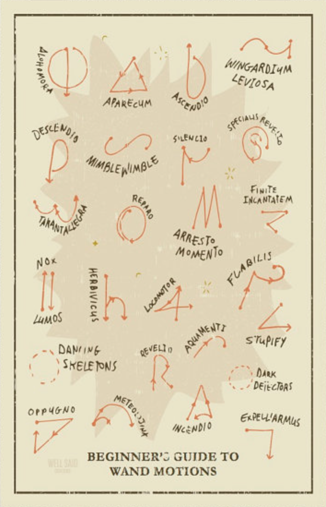

# 2018 Spring Engineering 96C Project proposal  - Harry Potter Wand

Team members: Wilson Jusuf, Varun Narayanan & Hanif Lim
Please see accompanying presentation: https://github.com/TheFearlessMagicians/wizdgetWand/blob/master/E96_Final_Presentation_WizdgetWand.ppt

### Problem
Many Harry Potter wands available for sale are static. They do not have any interactivity, which forces the  user to use his/her imagination to cast spells. According to our research, the most interactive Harry Potter wand available so far is the one for sale in Universal Studios Hollywood. Theme park goers may purchase a wand, and go to one of the designated spell-casting locations in almost any Universal Studios park in the world. Here, the user would point the wand to a rather poorly hidden infrared sensor, and go through a spell’s motion. If successful, some ‘magical action’ (chairs moving, wardrobes opening) would be triggered.

### Solution
We propose to design a motion-aware toy wand, which can register ‘spells’ casted by the user by use of motion capture technology. Embedded with the SensorTile, the wand must be able to distinguish between different spells, and tell the user which spell was casted by the use of a small buzzer/speaker.

### Spell Motion Registration
In order for the wand to be motion-aware, it needs a method to distinguish different motions. There are 25 popular incantations available in the Harry Potter World. Due to the high rise in complexity, we will not be registering all incantations. We devise a method for the wand to learn spell motions:

Every spell can be broken down to their atomic motions. For example, alohomora and ascendio have a clockwise semicircle motion from top to bottom. We may check the sequence of the atomic motions done, and devise an automata to register different states.

